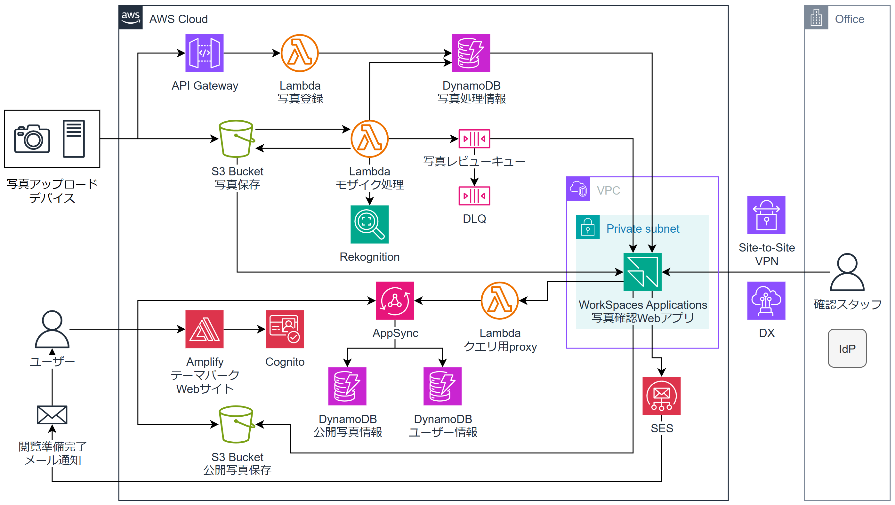

# テーマパークの体験フォト処理基盤

**テーマパーク等でアトラクション体験中の写真を撮影する「体験フォトサービス」を想定したシステムです。**  
**このリポジトリでは、体験フォトのメイン人物以外の顔を自動でモザイク処理し、**  
**作業スタッフが確認・修正を行い、ユーザーへ通知する体験フォト処理基盤をAWS上に構築します。**

次のような特徴があります。

- Amazon RekognitionのML画像分析APIを組み合わせた主要人物顔識別
- DynamoDBを用いた重複イベント処理の防止
- Amazon WorkSpaces Applicationsによる画面配信で、AWSからデータを持ち出さずに人間による確認・修正作業を実現
- AWS CDKによる体験フォト処理基盤の構築
- Amplify Gen2によるテーマパークWebサイトのフロントエンド・バックエンドの構築
- AWS CDKで構築したサービスとAmplify Gen2で構築したサービスの統合
- AWS Global Network内から公開AppSync APIへのクエリ
- ユーザー向けサービスとデータ処理基盤の分断、および公開データへのCognito IDプールによる認可制御

ブログ記事「」にて詳しく解説しています。

## 動作イメージ
WIP


## アーキテクチャ図



## ディレクトリ構成
```
.
├── backend  # 体験フォト処理基盤のCDKプロジェクト
│   ├── bin
│   ├── lib
│   │   ├── config   # CIDRなどの設定値
│   │   ├── network  # VPCほか
│   │   ├── photo-privacy-protection-system-stack.ts  # メインスタック
│   │   └── service  # 体験フォト処理基盤メインサービス
│   └── resources
│       ├── lambda
│       │   ├── auto-mosaic-function     # 自動モザイク処理Lambda関数ソースコード
│       │   ├── layer                    # Lambdaレイヤー
│       │   └── photo-register-function  # 体験フォト登録処理Lambda関数ソースコード
│       └── workspaces-applications-image-webapp  # WorkSpaces ApplicationsでホストするWebサーバーとWebアプリ
├── photo-upload-device  # 写真アップロードデバイスを模するプログラム
│   ├── main.py
│   ├── sample-photo-01.png
│   └── sample-photo-02.png
└── user-web  # ユーザー向けテーマパークWebサイトのAmplify Gen2プロジェクト
    ├── amplify
    └── app
```


## デプロイ方法

### 前提条件

- AWS CDKにて`cdk bootstrap`が完了している必要があります
- `@aws-cdk/aws-lambda-python-alpha`にてLambdaレイヤーを作成するためDockerが起動している必要があります

### デプロイ
1. CDKとAmplify Gen2をデプロイ（順不同、どちらを先にやっても大丈夫です）
  - backendディレクトリにて `$ cdk deploy` を実行
  - user-webディレクトリをAmplify CI/CDでデプロイ。サンドボックスの場合は `$ npx ampx sandbox` を実行

2. `backend/resources/workspaces-applications-image-webapp/README.md` に沿ってWorkSpaces Applications Stackを作成

### 動作確認
1. user-webのアプリへアクセスし、サインアップ

2. `photo-upload-device/main.py` の `API_ENDPOINT_URL`, `USER_ID`をそれぞれ書き換え（後者はCognitoユーザープールのSubの値）

3. `photo-upload-device/main.py` を実行し、体験フォトをアップロード

4. WorkSpaces Applications Stackのアプリへアクセスし、自動モザイク処理された体験フォトをレビュー

5. 体験フォトが閲覧可能になった旨の通知メールが届く

6. user-webのアプリ画面へアクセスし、体験フォトを確認


## 使用している画像について
- sample-photo-01として以下の画像を使用しました。
[白いシャツを着た男の浅い焦点の写真](https://unsplash.com/ja/%E5%86%99%E7%9C%9F/%E7%99%BD%E3%81%84%E3%82%B7%E3%83%A3%E3%83%84%E3%82%92%E7%9D%80%E3%81%9F%E7%94%B7%E3%81%AE%E6%B5%85%E3%81%84%E7%84%A6%E7%82%B9%E3%81%AE%E5%86%99%E7%9C%9F-nPz8akkUmDI)

- sample-photo-02として以下の画像を使用しました。
[メンズグレークルーネックTシャツ](https://unsplash.com/ja/%E5%86%99%E7%9C%9F/%E3%83%A1%E3%83%B3%E3%82%BA%E3%82%B0%E3%83%AC%E3%83%BC%E3%82%AF%E3%83%AB%E3%83%BC%E3%83%8D%E3%83%83%E3%82%AFt%E3%82%B7%E3%83%A3%E3%83%84-Of_m3hMsoAA)


## License
[MIT](./LICENSE-MIT)

